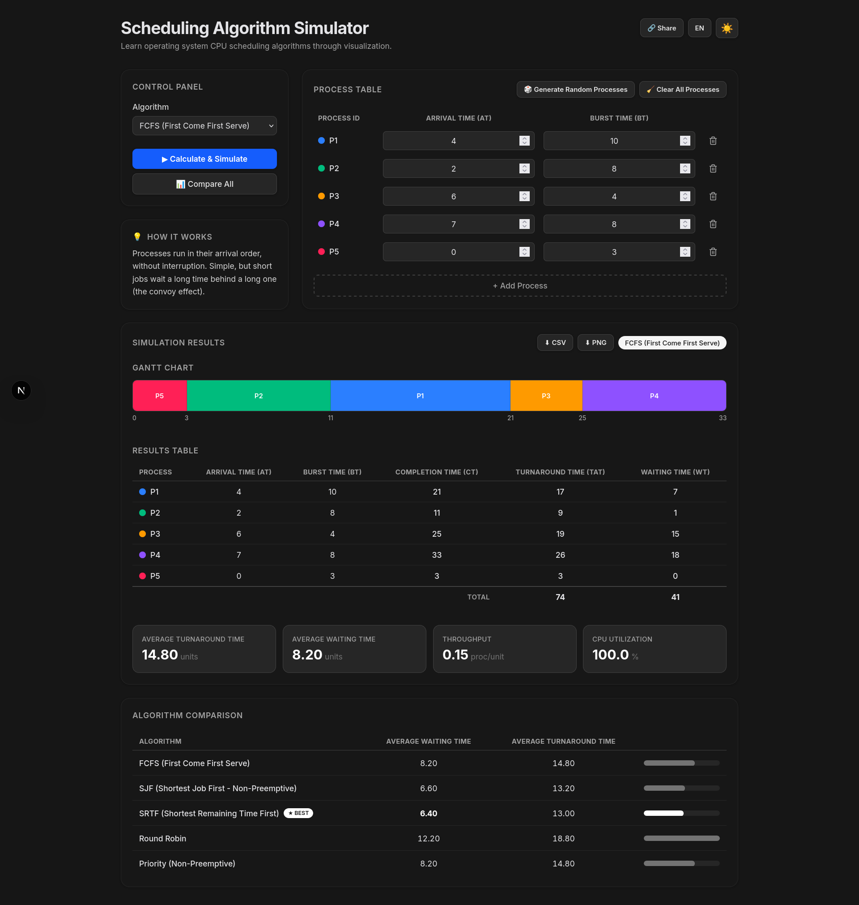

# Scheduling Algorithm Simulator

An interactive, bilingual (TR/EN) educational tool for visualizing operating-system CPU scheduling algorithms. Enter processes, run a scheduler, and see the Gantt chart, per-process metrics, and averages update instantly — or compare every algorithm side by side.

## Features

- **Five scheduling algorithms** — FCFS, SJF (non-preemptive), SRTF (preemptive), Round Robin (configurable time quantum), and Priority (non-preemptive).
- **Editable process table** — Add, delete, and edit processes, generate a random set, or clear all at once.
- **Gantt chart** — Color-coded, animated timeline of CPU execution with idle periods marked.
- **Results table** — Completion, turnaround, and waiting time per process, plus a totals row.
- **Aggregate metrics** — Average turnaround time, average waiting time, throughput, and CPU utilization.
- **Algorithm comparison** — Run all algorithms on the same input and highlight the best by average waiting time.
- **Export** — Download results as CSV or the Gantt chart as PNG.
- **Shareable links** — The current algorithm and process set are encoded into the URL; opening a shared link restores the inputs and runs the simulation automatically.
- **Theme & language** — Light/dark mode and Turkish/English toggles, both persisted in `localStorage`.

## Tech Stack

- [Next.js 16](https://nextjs.org) (App Router) with React 19
- [Tailwind CSS 4](https://tailwindcss.com)
- TypeScript
- [Vitest](https://vitest.dev) for unit tests

## Getting Started

Install dependencies and start the development server:

```bash
npm install
npm run dev
```

Open [http://localhost:3000](http://localhost:3000) in your browser.

### Scripts

| Command | Description |
| --- | --- |
| `npm run dev` | Start the development server |
| `npm run build` | Create a production build |
| `npm run start` | Serve the production build |
| `npm test` | Run the test suite once |
| `npm run test:watch` | Run tests in watch mode |

## Project Structure

```
app/          Next.js App Router entry (layout, page, global styles)
components/   React UI components (control panel, tables, charts, toggles)
lib/          Scheduling algorithms, timeline, export, share, and i18n logic
docs/         Screenshots and other documentation assets
```

## Screenshoot




## License

Released under the [MIT License](LICENSE).
