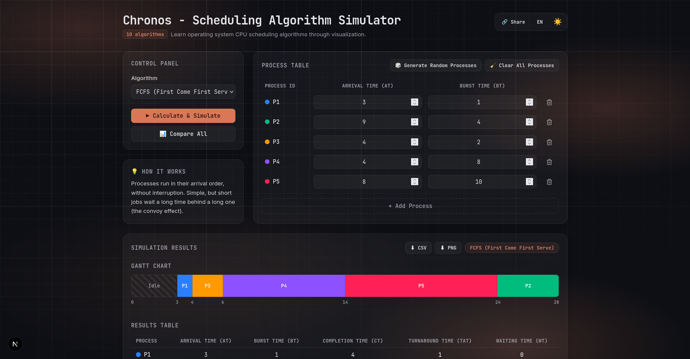
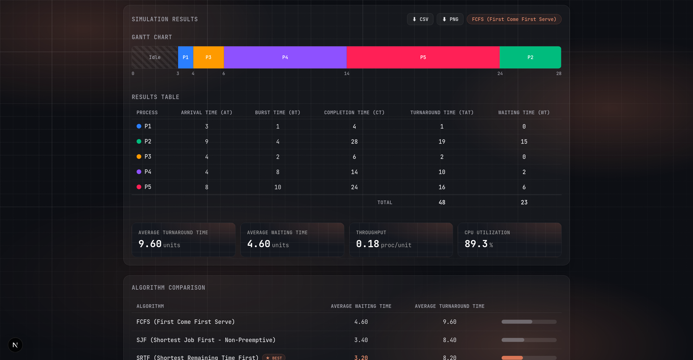

# Chronos

> Interactive CPU scheduling algorithm simulator with Gantt charts and side-by-side comparison.

Chronos is an interactive, bilingual (TR/EN) educational tool for visualizing operating-system CPU scheduling algorithms. Enter processes, run a scheduler, and watch the Gantt chart, per-process metrics, and averages update instantly — or compare all ten algorithms side by side to see which one performs best.

**[View the live application here.](https://chronos-batuhanmeral.vercel.app)**


## Features

- **Ten scheduling algorithms** — FCFS, SJF, SRTF, Round Robin, Priority (non-preemptive and preemptive), Priority + Aging, Priority Round Robin, HRRN, and MLFQ.
- **Editable process table** — Add, delete, and edit processes, generate a random set, or clear all at once.
- **Gantt chart** — Color-coded, animated timeline of CPU execution with idle periods clearly marked.
- **Results table** — Completion, turnaround, and waiting time per process, plus a totals row.
- **Aggregate metrics** — Average turnaround time, average waiting time, throughput, and CPU utilization.
- **Algorithm comparison** — Run all algorithms on the same input and highlight the best by average waiting time.
- **Export** — Download results as CSV or the Gantt chart as PNG.
- **Shareable links** — The current algorithm and process set are encoded into the URL; opening a shared link restores the inputs and runs the simulation automatically.
- **Theme & language** — Light/dark mode and Turkish/English toggles, both persisted in `localStorage`.
- **Algorithm explanations** — A "How It Works" card summarizes the selected algorithm in plain language.

## Algorithms

| Algorithm | Preemptive | Notes |
| --- | --- | --- |
| **FCFS** — First Come First Serve | No | Runs processes in arrival order. |
| **SJF** — Shortest Job First | No | Picks the shortest available burst time next. |
| **SRTF** — Shortest Remaining Time First | Yes | Preemptive variant of SJF; re-evaluates on every arrival. |
| **RR** — Round Robin | Yes | Cycles through processes using a configurable time quantum. |
| **Priority** | No | Runs the highest-priority available process (lower value = higher priority). |
| **Priority (Preemptive)** | Yes | A higher-priority arrival takes over the CPU immediately. |
| **Priority + Aging** | Yes | Waiting processes gain one effective priority level every 5 time units, preventing starvation. |
| **Priority Round Robin** | Yes | One queue per priority level; the highest-priority queue is served with Round Robin. |
| **HRRN** — Highest Response Ratio Next | No | Picks the highest `(waiting + burst) / burst` ratio; solves SJF's starvation problem. |
| **MLFQ** — Multi-Level Feedback Queue | Yes | Three queues: RR with quantum, RR with 2×quantum, then FCFS; jobs that exhaust their quantum are demoted. |

Each process is defined by an **arrival time (AT)**, a **burst time (BT)**, and a **priority** (used by the Priority family of algorithms). The time quantum applies to Round Robin, Priority Round Robin, and MLFQ.

## Tech Stack

- [Next.js 16](https://nextjs.org) (App Router) with React 19
- [Tailwind CSS 4](https://tailwindcss.com)
- TypeScript
- [Vitest](https://vitest.dev) for unit tests

## Installation

Requires [Node.js](https://nodejs.org) 20 or newer.

Install dependencies and start the development server:

```bash
npm install
npm run dev
```

Open [http://localhost:3000](http://localhost:3000) in your browser. Run the unit tests with `npm test`.

## Project Structure

```
app/          Next.js App Router entry (layout, page, global styles)
components/   React UI components (control panel, tables, charts, toggles)
lib/          Scheduling algorithms, timeline, export, share, and i18n logic
  algorithms/   One module per scheduler + shared helpers and tests
docs/         Screenshots and other documentation assets
```

## Screenshots

<table>
  <tr>
    <td align="center">
      
      <br />
      <sub>Control panel, algorithm explanation, editable process table and the Gantt chart</sub>
    </td>
  </tr>
  <tr>
    <td align="center">
      
      <br />
      <sub>Per-process results, aggregate metrics and the side-by-side algorithm comparison</sub>
    </td>
  </tr>
</table>

## License

Released under the [MIT License](LICENSE).
